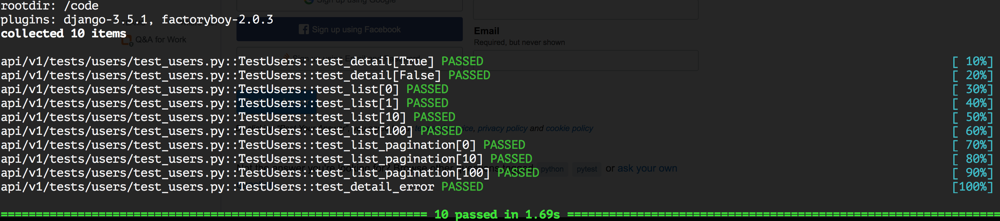

# Django + DRF + py.test (via Docker)  Boilerplate

A demo repo showing how it's possible to set up a pytest suite for a Django/DRF API project.
You can supply an API of proven quality as a result, without the direct necessity to test that manually.  

## What's used 

* Docker + Docker Compose
* Django + Django REST Framework
* Postgres
* pytest / pytest_django / pytest_factoryboy

## Prerequisites

* Docker and docker-compose are installed in your system and are running

## How to run

* `make test` - this will build a test Docker image and run the tests automatically.
You are expected to see a result like: 

## Entrypoint for self-study

* https://github.com/andreybulygin/django_drf_pytest/blob/master/Makefile#L14
